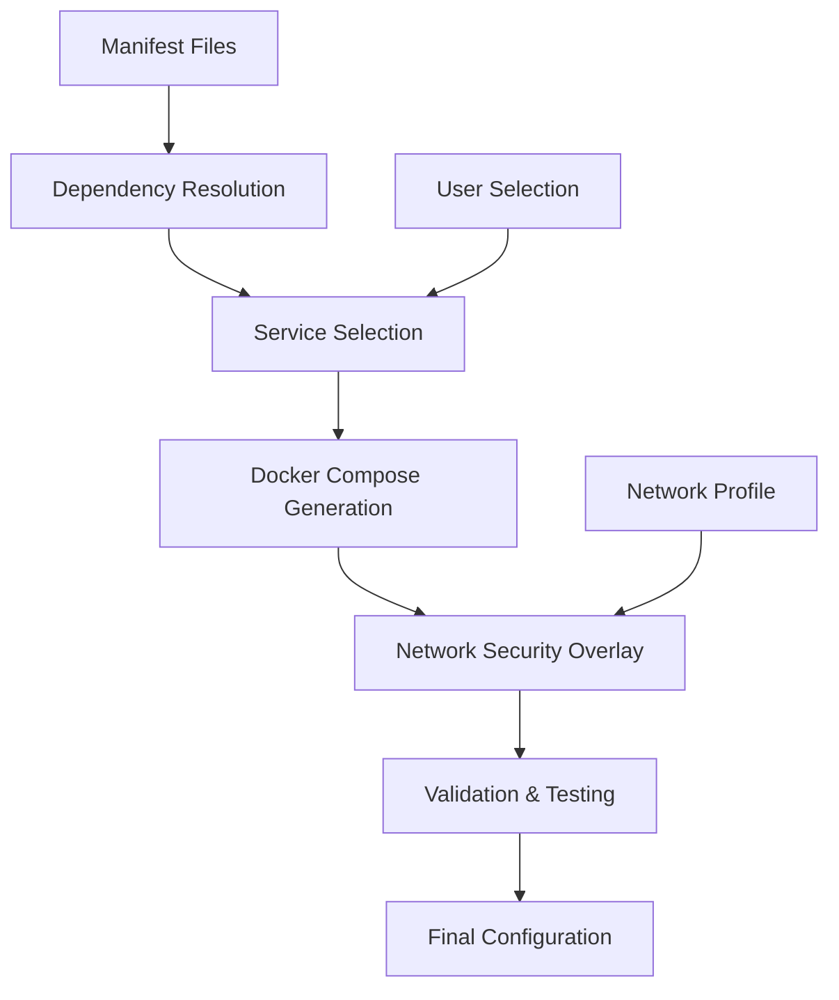

# 🍣 Sushi Kitchen Architecture

This document provides a comprehensive overview of the Sushi Kitchen platform architecture, including the 3-repository design, data flows, generation pipelines, and deployment strategies.

## Table of Contents

- [Overview](#overview)
- [3-Repository Architecture](#3-repository-architecture)
- [Core Components](#core-components)
- [Data Flow & Generation Pipeline](#data-flow--generation-pipeline)
- [API Architecture](#api-architecture)
- [Frontend Architecture](#frontend-architecture)
- [Security & Network Profiles](#security--network-profiles)
- [CI/CD Pipeline](#cicd-pipeline)
- [Deployment Strategies](#deployment-strategies)
- [Development Workflows](#development-workflows)
- [Extension Points](#extension-points)

## Overview

Sushi Kitchen is a composable, self-hosted AI development environment that allows users to build custom AI stacks by selecting different "platters," "combos," and "rolls" (Docker services). The architecture follows a clean separation of concerns across three repositories with the main repository serving as the single source of truth.

### Design Principles

1. **Single Source of Truth**: All manifests and generation logic reside in the main repository
2. **Separation of Concerns**: Clear boundaries between data, API, and frontend
3. **Composability**: Modular components that can be mixed and matched
4. **Extensibility**: Plugin-like architecture for adding new services
5. **Security-First**: Multiple network security profiles with proper isolation
6. **Developer Experience**: Type-safe APIs with auto-generated definitions

## 3-Repository Architecture

```
┌─────────────────┐    ┌─────────────────┐    ┌─────────────────┐
│  sushi-kitchen  │    │ sushi-kitchen-  │    │ sushi-kitchen-  │
│   (Main Repo)   │───▶│      api        │◀──▶│      web        │
│                 │    │  (Backend API)  │    │   (Frontend)    │
└─────────────────┘    └─────────────────┘    └─────────────────┘
        │                       │                       │
        │                       │                       │
        ▼                       ▼                       ▼
   Manifests              FastAPI Service          React/Next.js
   Scripts                Type Definitions          User Interface
   CI/CD                  Docker Compose            Static Assets
   Network Config         Bundle Serving            Web Components
```

### Repository Responsibilities

#### Main Repository (`sushi-kitchen`)
**Role**: Single Source of Truth & Generation Engine

```
sushi-kitchen/
├── docs/
│   ├── manifest/                   # Component definitions
│   │   ├── contracts.yml          # Service contracts & capabilities
│   │   ├── combos.yml             # Service combinations
│   │   ├── platters.yml           # Complete application stacks
│   │   └── network-profiles.yml   # Security profiles
│   └── architecture/              # This documentation
├── scripts/
│   ├── generate-compose.py        # Core Docker Compose generation
│   ├── generate-api-bundle.py     # API bundle creation
│   ├── generate-network-config.py # Network security overlay
│   ├── generate-types.ts          # TypeScript definition generator
│   └── export-manifest-json.py    # JSON export utility
├── .github/workflows/
│   └── manifest-sync.yml          # CI/CD pipeline
└── compose/                       # Docker service definitions
```

**Key Functions**:
- Define component relationships and dependencies
- Generate Docker Compose configurations
- Create API bundles with type safety
- Apply network security policies
- Maintain version control of all definitions

#### API Repository (`sushi-kitchen-api`)
**Role**: Backend Service & Orchestration Layer

```
sushi-kitchen-api/
├── app/
│   ├── main.py                    # FastAPI application
│   ├── models.py                  # Pydantic data models
│   └── orchestrators/
│       └── manifest_orchestrator.py # Core logic bridge
├── generated/                     # CI/CD generated files
│   ├── api-bundle.json           # Complete component catalog
│   └── types/sushi-kitchen.ts    # TypeScript definitions
├── docker-compose.api.yml        # Standalone deployment
└── Dockerfile                    # Container definition
```

**Key Functions**:
- Expose REST API for compose generation
- Orchestrate calls to main repository scripts
- Serve pre-built component bundles
- Provide TypeScript definitions for frontend
- Handle network security profile application
- Validate generated configurations

#### Web Repository (`sushi-kitchen-web`)
**Role**: User Interface & Experience

```
sushi-kitchen-web/
├── src/
│   ├── components/               # React components
│   ├── pages/                   # Application pages
│   ├── lib/
│   │   └── api/                # API client with generated types
│   └── types/                  # Imported TypeScript definitions
├── public/                     # Static assets
└── docs/                      # User documentation
```

**Key Functions**:
- Provide intuitive component selection interface
- Display real-time compose generation
- Offer configuration validation and preview
- Enable download of generated files
- Present documentation and tutorials

## Core Components

### Manifest System

The manifest system defines the building blocks of the Sushi Kitchen ecosystem:

#### Contracts (`contracts.yml`)
Defines individual services (rolls) with their capabilities and requirements:

```yaml
services:
  hosomaki.redis:
    name: "Redis Cache"
    description: "In-memory data store"
    provides: ["cap.cache", "cap.session-store"]
    requires: ["cap.networking"]
    conflicts: ["hosomaki.memcached"]
    docker:
      image: "redis:7"
      ports: [{ host: "6379", container: "6379" }]
    resource_requirements:
      memory_min: "128MB"
      cpu_min: "0.1"
```

#### Combos (`combos.yml`)
Groups of services that work together:

```yaml
combos:
  - id: combo.observability
    name: "Monitoring Stack"
    includes: ["dragon.prometheus", "dragon.grafana"]
    optional: ["dragon.alertmanager"]
    provides: ["cap.monitoring", "cap.alerting"]
```

#### Platters (`platters.yml`)
Complete application stacks:

```yaml
platters:
  - id: platter.ai-dev
    name: "AI Development Environment"
    includes: ["combo.core-data", "combo.ml-tools"]
    optional: ["combo.observability"]
    difficulty: "intermediate"
    estimated_setup_time_min: 45
```

### Generation Pipeline

The generation pipeline transforms manifests into deployable configurations:



### Dependency Resolution

The system automatically resolves service dependencies:

1. **Capability Matching**: Services declare required capabilities
2. **Provider Discovery**: Find services that provide those capabilities
3. **Conflict Resolution**: Handle incompatible services
4. **Optimization**: Choose optimal providers for capabilities

## Data Flow & Generation Pipeline

### 1. User Request Flow

```
User Selection → API Endpoint → Orchestrator → Core Scripts → Docker Compose
     ↓              ↓             ↓             ↓              ↓
  platter.ai    /generate    ManifestOrch.  generate-    docker-compose.yml
                              py            compose.py
```

### 2. CI/CD Generation Flow

```
Manifest Change → GitHub Action → Bundle Generation → Type Generation → API Update
       ↓              ↓              ↓                 ↓              ↓
   commits to     manifest-sync   api-bundle.json   sushi.ts    Cache Refresh
   docs/manifest     .yml
```

### 3. Network Security Application

```
Base Compose → Network Profile → Security Policies → Final Compose
     ↓              ↓               ↓                 ↓
  services:    chirashi/temaki/  network isolation   deployed
  - redis      inari profile    + security opts     config
  - postgres
```

## API Architecture

### FastAPI Service Structure

```python
# Endpoint Organization
/api/v1/compose/         # Compose generation
/api/v1/components/      # Component discovery
/api/v1/network-profiles/ # Security profiles
/api/v1/types/           # Type definitions
/admin/                  # Administrative endpoints
```

### Request/Response Flow

#### Generate Compose Request
```json
{
  "selection_type": "platter",
  "selection_id": "platter.ai-dev",
  "privacy_profile": "temaki",
  "include_optional": true
}
```

#### Generate Compose Response
```json
{
  "yaml": "version: '3.9'\nservices:\n...",
  "services": ["postgres", "redis", "ollama"],
  "profile": "temaki",
  "success": true,
  "validation": {
    "valid": true,
    "warnings": [],
    "errors": []
  }
}
```

### Orchestration Layer

The `ManifestOrchestrator` class bridges the API and core scripts:

```python
class ManifestOrchestrator:
    async def generate_complete_stack(self, ...):
        # 1. Generate base compose
        compose_yaml = await self._run_compose_generator(...)

        # 2. Apply network configuration
        networked_compose = await self._apply_network_config(...)

        # 3. Apply security policies
        final_compose = await self._apply_security_policies(...)

        return final_compose
```

## Frontend Architecture

### Component Hierarchy

```
App
├── Layout
│   ├── Header
│   ├── Navigation
│   └── Footer
├── Pages
│   ├── ComponentBrowser
│   ├── ComposeGenerator
│   └── Documentation
└── Shared Components
    ├── ComponentCard
    ├── ConfigPreview
    └── DownloadButton
```

### State Management

The frontend uses a predictable state pattern:

```typescript
interface AppState {
  selectedComponents: ComponentSelection;
  generatedCompose: ComposeResult | null;
  networkProfile: NetworkProfileType;
  validationState: ValidationResult;
}
```

### API Integration

Type-safe API calls using generated definitions:

```typescript
import { GenerateRequest, GenerateResponse } from '@/types/sushi-kitchen';

const generateCompose = async (request: GenerateRequest): Promise<GenerateResponse> => {
  // Fully type-safe API call
  return await api.post('/api/v1/compose/generate', request);
};
```

## Security & Network Profiles

### Network Security Profiles

#### Chirashi (Development)
- **Use Case**: Research, development, learning
- **Security Level**: Low
- **Network**: Single bridge network
- **Suitable For**: Local development, testing

```yaml
networks:
  sushi_net:
    driver: bridge
    ipam:
      config: [{ subnet: '172.20.0.0/16' }]
```

#### Temaki (Business)
- **Use Case**: Small business, production workloads
- **Security Level**: Medium
- **Network**: Segmented frontend/backend/data
- **Suitable For**: Production deployments, team environments

```yaml
networks:
  sushi_frontend:    # Web-facing services
  sushi_backend:     # Application services (internal)
  sushi_data:        # Database services (internal)
```

#### Inari (Enterprise)
- **Use Case**: Enterprise, compliance, high-security
- **Security Level**: High
- **Network**: Multi-tier with strict isolation
- **Suitable For**: Enterprise deployments, regulated environments

```yaml
networks:
  sushi_web_tier:    # 172.21.1.0/24 - Load balancers, web servers
  sushi_app_tier:    # 172.21.2.0/24 - Application services
  sushi_data_tier:   # 172.21.3.0/24 - Databases (isolated)
  sushi_mgmt_tier:   # 172.21.4.0/24 - Monitoring, management
```

### Security Policy Application

Each profile applies progressive security hardening:

```python
# Inari (Enterprise) Security Policies
service_config.update({
    'security_opt': [
        'no-new-privileges:true',
        'apparmor:docker-default'
    ],
    'read_only': True,
    'cap_drop': ['ALL'],
    'tmpfs': ['/tmp']
})
```

## CI/CD Pipeline

### GitHub Actions Workflow

The `manifest-sync.yml` workflow orchestrates the entire generation pipeline:

```yaml
# Triggered on manifest changes
on:
  push:
    paths:
      - 'docs/manifest/**'
      - 'scripts/**'

jobs:
  generate-and-deploy:
    steps:
      - name: Generate API Bundle
      - name: Generate TypeScript Types
      - name: Validate Generated Files
      - name: Upload to Artifacts
      - name: Deploy to S3 (optional)
      - name: Invalidate API Cache
```

### Generation Steps

1. **Bundle Creation**: `generate-api-bundle.py` processes all manifests
2. **Type Generation**: `generate-types.ts` creates TypeScript definitions
3. **Validation**: Verify bundle structure and type correctness
4. **Deployment**: Upload to artifacts, S3, and notify API service

### Versioning Strategy

Each bundle is versioned with:
- Timestamp: `bundle-20241201-143022`
- Commit SHA: `bundle-20241201-143022-a1b2c3d4`
- Build metadata: CI run ID, branch information

## Deployment Strategies

### Development Deployment

```bash
# Main repository (all services)
docker compose --profile hosomaki up -d

# API service (standalone)
cd sushi-kitchen-api
docker compose -f docker-compose.api.yml up -d

# Web frontend (development server)
cd sushi-kitchen-web
npm run dev
```

### Production Deployment

#### Option 1: Integrated Deployment
All services deployed together with shared networking:

```bash
# Deploy main stack with API included
docker compose --profile hosomaki --profile api up -d
```

#### Option 2: Microservice Deployment
Services deployed independently with external networking:

```bash
# Deploy core services
docker compose --profile hosomaki up -d

# Deploy API service separately
cd ../sushi-kitchen-api
CORE_REPO_PATH=/path/to/sushi-kitchen docker compose up -d

# Deploy web frontend (static)
cd ../sushi-kitchen-web
npm run build && npm run start
```

#### Option 3: Kubernetes Deployment
Helm charts for container orchestration:

```yaml
# values.yaml
api:
  image: sushi-kitchen-api:latest
  replicas: 3
  coreRepoPath: /mnt/sushi-kitchen

web:
  image: sushi-kitchen-web:latest
  replicas: 2
```

### Container Registry Strategy

```bash
# Build and tag images
docker build -t ghcr.io/org/sushi-kitchen-api:v1.0.0 sushi-kitchen-api/
docker build -t ghcr.io/org/sushi-kitchen-web:v1.0.0 sushi-kitchen-web/

# Push to registry
docker push ghcr.io/org/sushi-kitchen-api:v1.0.0
```

## Development Workflows

### Adding a New Service (Roll)

1. **Define Contract** (`docs/manifest/contracts.yml`):
```yaml
services:
  category.service-name:
    name: "Service Display Name"
    provides: ["cap.capability"]
    requires: ["cap.dependency"]
    docker:
      image: "service:tag"
```

2. **Test Generation**:
```bash
python scripts/generate-compose.py --roll category.service-name
```

3. **Update Documentation**:
```bash
# CI/CD automatically regenerates API bundle and types
git add docs/manifest/contracts.yml
git commit -m "Add new service: category.service-name"
```

### Adding a New Combo

1. **Define Combo** (`docs/manifest/combos.yml`):
```yaml
combos:
  - id: combo.my-stack
    name: "My Custom Stack"
    includes: ["service.a", "service.b"]
    optional: ["service.c"]
```

2. **Test Integration**:
```bash
python scripts/generate-compose.py --combo combo.my-stack --include-optional
```

### Adding a New Platter

1. **Define Platter** (`docs/manifest/platters.yml`):
```yaml
platters:
  - id: platter.my-platform
    name: "My Development Platform"
    includes: ["combo.core", "combo.my-stack"]
    difficulty: "intermediate"
```

2. **Full Integration Test**:
```bash
python scripts/generate-compose.py --platter platter.my-platform
docker compose -f generated.yml config  # Validate syntax
```

### Frontend Development Workflow

1. **Type Safety**: Generated types ensure compile-time API compatibility
2. **Hot Reload**: Frontend automatically reflects API changes
3. **Component Testing**: Isolated component development with mock API
4. **Integration Testing**: End-to-end testing with real API

## Extension Points

### Custom Network Profiles

Add new security profiles by extending `generate-network-config.py`:

```python
def _generate_custom_network(self) -> Dict:
    return {
        'custom_frontend': {...},
        'custom_backend': {...},
        'custom_data': {...}
    }
```

### Custom Service Categories

Define new service categories in manifests:

```yaml
# New category: machine-learning
services:
  ml.tensorflow:
    name: "TensorFlow Serving"
    category: "ml"
    provides: ["cap.ml-inference"]
```

### Plugin Architecture

Services can define plugin interfaces:

```yaml
services:
  app.main:
    plugins:
      - interface: "auth"
        implementations: ["auth.oauth", "auth.ldap"]
      - interface: "storage"
        implementations: ["storage.s3", "storage.nfs"]
```

### Custom Generators

Create specialized generators by extending the base scripts:

```python
class CustomComposeGenerator(ManifestResolver):
    def generate_helm_chart(self, roll_ids: Set[str]) -> Dict:
        # Convert Docker Compose to Helm chart
        pass

    def generate_terraform(self, roll_ids: Set[str]) -> str:
        # Generate Terraform configuration
        pass
```

### API Extensions

Add custom endpoints to the FastAPI service:

```python
@app.get("/api/v1/custom/health-check")
async def custom_health_check():
    # Custom health checking logic
    return {"status": "healthy", "custom": True}
```

---

## Architecture Decision Records

### ADR-001: 3-Repository Architecture
**Decision**: Split into main (manifests), api (backend), web (frontend) repositories
**Rationale**: Clear separation of concerns, independent deployment, team ownership
**Status**: ✅ Implemented

### ADR-002: Single Source of Truth in Main Repo
**Decision**: All manifests and generation logic stay in main repository
**Rationale**: Prevents duplication, ensures consistency, simplifies maintenance
**Status**: ✅ Implemented

### ADR-003: Generated Types for Frontend
**Decision**: Auto-generate TypeScript types from API bundles
**Rationale**: Compile-time safety, automatic API/frontend sync, reduced errors
**Status**: ✅ Implemented

### ADR-004: Network Security Profiles
**Decision**: Three-tier security model (chirashi/temaki/inari)
**Rationale**: Progressive security, clear use case alignment, flexibility
**Status**: ✅ Implemented

### ADR-005: Container-First Architecture
**Decision**: All services deployable via Docker Compose
**Rationale**: Consistency, portability, simplified local development
**Status**: ✅ Implemented

---

*This architecture documentation is maintained alongside the codebase and updated with each significant architectural change.*