# Data Flows & Processing Pipelines

This document details the various data flows within the Sushi Kitchen architecture, from user interactions to deployed configurations.

## Primary Data Flows

### 1. User Request to Generated Compose


### 2. CI/CD Bundle Generation


### 3. Component Discovery Flow


## Data Transformation Pipeline

### Manifest Processing


### Service Resolution Logic

```python
# Pseudocode for service resolution
def resolve_services(selection_id: str, selection_type: str) -> Set[str]:
    initial_services = get_services_for_selection(selection_id, selection_type)
    resolved_services = set()

    for service in initial_services:
        resolved_services.add(service)

        # Resolve required capabilities
        for capability in service.requires:
            provider = find_capability_provider(capability)
            if provider:
                resolved_services.add(provider)

        # Add suggested services
        for suggestion in service.suggests:
            if suggestion not in conflicts:
                resolved_services.add(suggestion)

    return resolved_services
```

## Network Security Data Flow

### Profile Application Process


### Service Classification Logic

```python
def classify_service(service_name: str, service_config: Dict) -> str:
    """Determine network tier for a service based on its characteristics"""

    # Web-facing services
    if service_name in ['caddy', 'homepage', 'grafana', 'n8n']:
        return 'web'

    # Check for exposed HTTP ports
    ports = service_config.get('ports', [])
    if any('80' in str(port) or '443' in str(port) for port in ports):
        return 'web'

    # Data services
    if service_name in ['postgres', 'neo4j', 'redis', 'qdrant']:
        return 'data'

    # Management/monitoring
    if service_name in ['prometheus', 'grafana', 'cadvisor']:
        return 'management'

    # Default to application tier
    return 'application'
```

## API Data Structures

### Request/Response Flow

```mermaid
flowchart TD
    subgraph "Client Request"
        A[GenerateRequest]
        A1[selection_type: string]
        A2[selection_id: string]
        A3[privacy_profile: string]
        A4[include_optional: boolean]
    end

    subgraph "Server Processing"
        B[Validation Layer]
        C[Orchestration Layer]
        D[Generation Layer]
        E[Security Layer]
    end

    subgraph "Server Response"
        F[GenerateResponse]
        F1[yaml: string]
        F2[services: string[]]
        F3[profile: string]
        F4[success: boolean]
        F5[validation: ValidationResult]
    end

    A --> B
    B --> C
    C --> D
    D --> E
    E --> F

    A -.-> A1
    A -.-> A2
    A -.-> A3
    A -.-> A4

    F -.-> F1
    F -.-> F2
    F -.-> F3
    F -.-> F4
    F -.-> F5
```

### Bundle Structure

```json
{
  "version": "1.0.0",
  "generated_at": "2024-01-15T10:30:00Z",
  "build": {
    "version_tag": "bundle-20240115-103000-a1b2c3d4",
    "commit_sha": "a1b2c3d4e5f6...",
    "branch": "main",
    "workflow_run": "12345"
  },
  "checksums": {
    "contracts.yml": "sha256:abc123...",
    "combos.yml": "sha256:def456...",
    "platters.yml": "sha256:789xyz..."
  },
  "services": {
    "hosomaki.redis": {
      "id": "hosomaki.redis",
      "name": "Redis Cache",
      "category": "hosomaki",
      "provides": ["cap.cache"],
      "requires": ["cap.networking"],
      "docker": {...},
      "resource_requirements": {...}
    }
  },
  "combos": {...},
  "platters": {...},
  "capabilities": {...},
  "network_profiles": {...}
}
```

## Error Handling & Validation

### Validation Pipeline


### Error Response Structure

```typescript
interface ValidationResult {
  valid: boolean;
  warnings: string[];
  errors: string[];
}

interface ErrorResponse {
  success: false;
  error: string;
  details?: ValidationResult;
  timestamp: string;
}
```

## Performance Optimization

### Caching Strategy

```mermaid
flowchart TD
    subgraph "Cache Layers"
        A[In-Memory Component Cache]
        B[Generated Bundle Cache]
        C[Compiled Template Cache]
    end

    subgraph "Cache Invalidation"
        D[Git Webhook]
        E[Manual Admin Endpoint]
        F[TTL Expiration]
    end

    subgraph "Cache Warming"
        G[CI/CD Bundle Generation]
        H[Background Pre-compilation]
        I[Startup Cache Loading]
    end

    A --> B --> C
    D --> A
    E --> B
    F --> C
    G --> B
    H --> C
    I --> A
```



### Data Loading Optimization

```python
class OptimizedDataLoader:
    def __init__(self):
        self._bundle_cache = {}
        self._last_modified = {}

    async def load_bundle(self) -> Dict:
        bundle_path = self.generated_dir / 'api-bundle.json'

        # Check if file has been modified
        current_mtime = bundle_path.stat().st_mtime
        cached_mtime = self._last_modified.get('bundle')

        if cached_mtime and current_mtime <= cached_mtime:
            return self._bundle_cache['bundle']

        # Load and cache new data
        with bundle_path.open() as f:
            bundle = json.load(f)

        self._bundle_cache['bundle'] = bundle
        self._last_modified['bundle'] = current_mtime

        return bundle
```

## Monitoring & Observability

### Data Flow Metrics


### Health Check Data Flow

```python
@app.get("/health")
async def health_check():
    """Comprehensive health check covering all data flows"""

    checks = {
        "core_repo_accessible": check_core_repo(),
        "scripts_available": check_scripts(),
        "bundle_cache_healthy": check_bundle_cache(),
        "generation_pipeline": check_generation(),
        "network_profiles": check_network_profiles(),
        "typescript_types": check_types()
    }

    overall_health = all(checks.values())

    return {
        "status": "healthy" if overall_health else "degraded",
        "timestamp": datetime.utcnow().isoformat(),
        "checks": checks,
        "version": get_version_info()
    }
```

This data flow documentation provides the technical details needed to understand how data moves through the Sushi Kitchen architecture, from user interactions to deployed configurations.