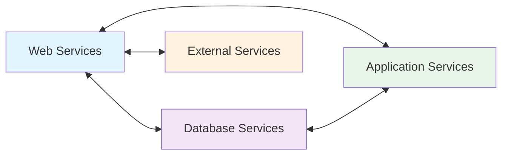
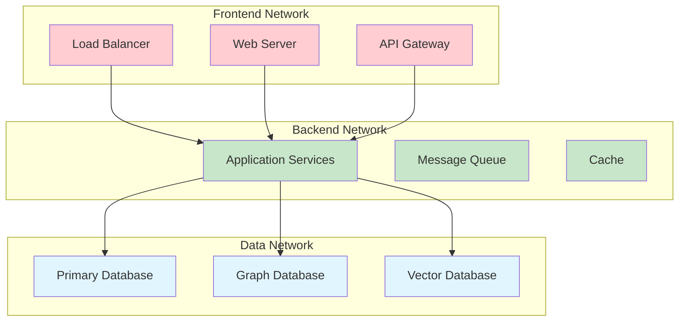
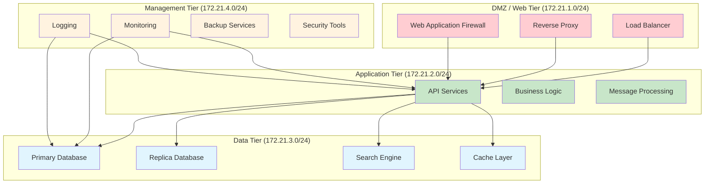

# Security Model & Network Profiles

This document details the security architecture of Sushi Kitchen, including network isolation strategies, security policies, and threat mitigation approaches.

## Security Philosophy

Sushi Kitchen implements a **defense-in-depth** security model with multiple layers of protection:

1. **Network Segmentation**: Isolated networks based on service function and sensitivity
2. **Container Security**: Hardened containers with minimal privileges
3. **Access Controls**: Role-based access with proper authentication
4. **Data Protection**: Encryption at rest and in transit
5. **Audit Logging**: Comprehensive logging for security monitoring

## Network Security Profiles

### Profile Overview

| Profile | Use Case | Security Level | Network Complexity | Suitable Environment |
|---------|----------|----------------|-------------------|---------------------|
| **Chirashi** | Development, Research | Low | Single network | Local development |
| **Temaki** | Small Business, Production | Medium | 3-tier segmentation | Small teams, startups |
| **Inari** | Enterprise, Compliance | High | Multi-tier isolation | Enterprise, regulated industries |

### Chirashi Profile (Development)

**Security Model**: Convenience over security for development environments.

```yaml
# Network Architecture
networks:
  sushi_net:
    driver: bridge
    ipam:
      config:
        - subnet: '172.20.0.0/16'
```

**Security Characteristics**:
- ✅ **Pros**: Simple setup, easy debugging, fast development
- ⚠️ **Cons**: No isolation, all services can communicate
- 🎯 **Use Case**: Local development, learning, experimentation

**Service Communication**:


### Temaki Profile (Business Production)

**Security Model**: Balanced security with operational simplicity.

```yaml
# Network Architecture
networks:
  sushi_frontend:
    driver: bridge
    external: true
  sushi_backend:
    driver: bridge
    internal: true
  sushi_data:
    driver: bridge
    internal: true
```

**Security Characteristics**:
- ✅ **Pros**: Good security-performance balance, manageable complexity
- ⚠️ **Limitations**: Basic segmentation, shared backend network
- 🎯 **Use Case**: Small businesses, team environments, production workloads

**Network Segmentation**:


**Service Classification Logic**:
```python
def classify_service_temaki(service_name: str, config: Dict) -> List[str]:
    """Determine network assignments for Temaki profile"""

    # Web-facing services
    if service_name in ['caddy', 'homepage', 'n8n'] or \
       has_exposed_ports(config, [80, 443, 3000, 8080]):
        return ['sushi_frontend', 'sushi_backend']

    # Data services - isolated
    elif service_name in ['postgres', 'neo4j', 'redis', 'qdrant']:
        return ['sushi_data']

    # Application services
    else:
        return ['sushi_backend']
```

### Inari Profile (Enterprise Security)

**Security Model**: Maximum security with strict isolation for enterprise environments.

```yaml
# Network Architecture
networks:
  sushi_web_tier:
    driver: bridge
    ipam:
      config: [{ subnet: '172.21.1.0/24' }]
  sushi_app_tier:
    driver: bridge
    internal: true
    ipam:
      config: [{ subnet: '172.21.2.0/24' }]
  sushi_data_tier:
    driver: bridge
    internal: true
    ipam:
      config: [{ subnet: '172.21.3.0/24' }]
  sushi_mgmt_tier:
    driver: bridge
    internal: true
    ipam:
      config: [{ subnet: '172.21.4.0/24' }]
```

**Security Characteristics**:
- ✅ **Pros**: Maximum isolation, compliance-ready, audit-friendly
- ⚠️ **Complexity**: Requires network expertise, more operational overhead
- 🎯 **Use Case**: Enterprise deployments, regulated industries, high-security environments

**Multi-Tier Architecture**:


## Container Security Policies

### Security Hardening by Profile

#### Chirashi (Development) - Basic Security
```yaml
# Minimal security for development ease
security_opt:
  - no-new-privileges:true
```

#### Temaki (Business) - Enhanced Security
```yaml
# Business-level security hardening
security_opt:
  - no-new-privileges:true
  - seccomp:unconfined
cap_drop:
  - NET_ADMIN
  - SYS_ADMIN
read_only: false  # Allow some write operations
```

#### Inari (Enterprise) - Maximum Security
```yaml
# Enterprise-level security hardening
security_opt:
  - no-new-privileges:true
  - apparmor:docker-default
  - seccomp:/etc/docker/seccomp-profiles/default.json
cap_drop:
  - ALL
cap_add:
  - CHOWN      # Only if specifically needed
  - SETGID     # Only if specifically needed
  - SETUID     # Only if specifically needed
read_only: true
tmpfs:
  - /tmp
  - /var/tmp
user: "1000:1000"  # Non-root user
```

### Security Policy Implementation

```python
class SecurityPolicyApplicator:
    def apply_security_policies(self, compose_dict: Dict, profile: str) -> Dict:
        """Apply security policies based on profile"""

        for service_name, service_config in compose_dict.get('services', {}).items():
            if profile == 'inari':
                self._apply_enterprise_security(service_config, service_name)
            elif profile == 'temaki':
                self._apply_business_security(service_config, service_name)
            elif profile == 'chirashi':
                self._apply_development_security(service_config, service_name)

        return compose_dict

    def _apply_enterprise_security(self, config: Dict, service_name: str):
        """Apply maximum security for enterprise environments"""

        # Mandatory security options
        config.setdefault('security_opt', []).extend([
            'no-new-privileges:true',
            'apparmor:docker-default'
        ])

        # Read-only root filesystem
        config['read_only'] = True

        # Drop all capabilities by default
        config['cap_drop'] = ['ALL']

        # Add specific capabilities only if needed
        if service_name in self._get_privileged_services():
            config['cap_add'] = self._get_required_capabilities(service_name)

        # Non-root user
        if service_name not in ['postgres', 'neo4j']:  # Some services require specific users
            config['user'] = '1000:1000'

        # Temporary filesystems for writable areas
        config.setdefault('tmpfs', []).extend(['/tmp', '/var/tmp'])

        # Resource limits
        config.setdefault('deploy', {}).setdefault('resources', {}).update({
            'limits': {
                'cpus': '2.0',
                'memory': '2G'
            },
            'reservations': {
                'cpus': '0.1',
                'memory': '128M'
            }
        })
```

## Access Control and Authentication

### Service-to-Service Authentication

```yaml
# Inter-service authentication using shared secrets
services:
  api-service:
    environment:
      - JWT_SECRET_FILE=/run/secrets/jwt_secret
      - DB_PASSWORD_FILE=/run/secrets/db_password
    secrets:
      - jwt_secret
      - db_password

secrets:
  jwt_secret:
    file: ./secrets/jwt_secret.txt
  db_password:
    file: ./secrets/db_password.txt
```

### API Authentication

```python
# FastAPI security implementation
from fastapi import Depends, HTTPException, status
from fastapi.security import HTTPBearer, HTTPAuthorizationCredentials

security = HTTPBearer()

async def verify_token(credentials: HTTPAuthorizationCredentials = Depends(security)):
    """Verify JWT token for API access"""
    try:
        payload = jwt.decode(
            credentials.credentials,
            settings.SECRET_KEY,
            algorithms=["HS256"]
        )
        username: str = payload.get("sub")
        if username is None:
            raise HTTPException(status_code=401, detail="Invalid token")
        return username
    except JWTError:
        raise HTTPException(status_code=401, detail="Invalid token")

@app.post("/api/v1/compose/generate")
async def generate_compose(
    request: GenerateRequest,
    current_user: str = Depends(verify_token)  # Require authentication
):
    # API implementation
    pass
```

### Role-Based Access Control (RBAC)

```python
class Role(Enum):
    VIEWER = "viewer"      # Read-only access
    DEVELOPER = "developer"  # Generate configs, view components
    ADMIN = "admin"        # Full access including admin endpoints

class Permission(Enum):
    READ_COMPONENTS = "read:components"
    GENERATE_COMPOSE = "generate:compose"
    ADMIN_CACHE = "admin:cache"
    ADMIN_METRICS = "admin:metrics"

ROLE_PERMISSIONS = {
    Role.VIEWER: [Permission.READ_COMPONENTS],
    Role.DEVELOPER: [Permission.READ_COMPONENTS, Permission.GENERATE_COMPOSE],
    Role.ADMIN: [Permission.READ_COMPONENTS, Permission.GENERATE_COMPOSE,
                 Permission.ADMIN_CACHE, Permission.ADMIN_METRICS]
}

def require_permission(permission: Permission):
    def decorator(func):
        async def wrapper(*args, current_user: str = Depends(verify_token), **kwargs):
            user_role = get_user_role(current_user)
            if permission not in ROLE_PERMISSIONS.get(user_role, []):
                raise HTTPException(status_code=403, detail="Insufficient permissions")
            return await func(*args, **kwargs)
        return wrapper
    return decorator

@app.post("/admin/cache/refresh")
@require_permission(Permission.ADMIN_CACHE)
async def refresh_cache():
    # Admin-only endpoint
    pass
```

## Data Protection

### Encryption at Rest

```yaml
# Database encryption
postgres:
  environment:
    - POSTGRES_INITDB_ARGS=--data-checksums
  volumes:
    - postgres_data:/var/lib/postgresql/data
  command: >
    postgres
    -c ssl=on
    -c ssl_cert_file=/etc/ssl/certs/postgres.crt
    -c ssl_key_file=/etc/ssl/private/postgres.key
    -c ssl_ca_file=/etc/ssl/certs/ca.crt
```

### Encryption in Transit

```yaml
# TLS configuration
caddy:
  image: caddy:2
  ports:
    - "443:443"
  volumes:
    - ./config/caddy/Caddyfile:/etc/caddy/Caddyfile
  environment:
    - CADDY_AGREE=true
```

```caddyfile
# Automatic HTTPS with strong TLS settings
{
    servers {
        protocols h1 h2 h3
    }
}

api.example.com {
    reverse_proxy sushi-api:8000 {
        header_up Host {host}
        header_up X-Real-IP {remote_host}
        header_up X-Forwarded-Proto {scheme}
    }

    tls {
        protocols tls1.2 tls1.3
        ciphers TLS_AES_256_GCM_SHA384 TLS_CHACHA20_POLY1305_SHA256 TLS_AES_128_GCM_SHA256
    }

    header {
        Strict-Transport-Security "max-age=31536000; includeSubDomains; preload"
        X-Frame-Options "DENY"
        X-Content-Type-Options "nosniff"
        Referrer-Policy "strict-origin-when-cross-origin"
        Content-Security-Policy "default-src 'self'; script-src 'self' 'unsafe-inline'; style-src 'self' 'unsafe-inline'"
    }
}
```

### Secret Management

```yaml
# Docker Secrets for sensitive data
version: '3.9'

services:
  api:
    secrets:
      - db_password
      - jwt_secret
      - encryption_key
    environment:
      - DB_PASSWORD_FILE=/run/secrets/db_password
      - JWT_SECRET_FILE=/run/secrets/jwt_secret
      - ENCRYPTION_KEY_FILE=/run/secrets/encryption_key

secrets:
  db_password:
    external: true
  jwt_secret:
    external: true
  encryption_key:
    external: true
```

## Security Monitoring and Auditing

### Security Event Logging

```python
import structlog
from fastapi import Request

# Structured logging for security events
security_logger = structlog.get_logger("security")

async def log_security_event(
    request: Request,
    event_type: str,
    user: str = None,
    details: Dict = None
):
    """Log security-relevant events"""

    await security_logger.info(
        "security_event",
        event_type=event_type,
        user=user,
        client_ip=request.client.host,
        user_agent=request.headers.get("user-agent"),
        path=request.url.path,
        method=request.method,
        timestamp=datetime.utcnow().isoformat(),
        details=details or {}
    )

# Usage in endpoints
@app.post("/api/v1/compose/generate")
async def generate_compose(
    request: Request,
    compose_request: GenerateRequest,
    current_user: str = Depends(verify_token)
):
    await log_security_event(
        request,
        "compose_generation",
        user=current_user,
        details={
            "selection_type": compose_request.selection_type,
            "selection_id": compose_request.selection_id,
            "profile": compose_request.privacy_profile
        }
    )
    # ... rest of implementation
```

### Intrusion Detection

```yaml
# Security monitoring services
services:
  # Fail2ban for brute force protection
  fail2ban:
    image: crazymax/fail2ban:latest
    network_mode: "host"
    cap_add:
      - NET_ADMIN
      - NET_RAW
    volumes:
      - ./config/fail2ban:/etc/fail2ban
      - /var/log:/var/log:ro

  # OSSEC for host intrusion detection
  ossec:
    image: atomicorp/ossec-docker
    volumes:
      - ./config/ossec:/var/ossec/etc
      - /var/log:/var/log:ro
    ports:
      - "1514:1514/udp"
```

### Vulnerability Scanning

```bash
#!/bin/bash
# security-scan.sh - Regular vulnerability scanning

echo "🔍 Running security scans..."

# Container vulnerability scanning
echo "Scanning container images..."
docker run --rm -v /var/run/docker.sock:/var/run/docker.sock \
  aquasec/trivy image sushi-kitchen-api:latest

# Network scanning
echo "Scanning network configuration..."
nmap -sS -A localhost

# Dependency scanning
echo "Scanning Python dependencies..."
safety check --json --output safety-report.json

# Configuration scanning
echo "Scanning Docker Compose configurations..."
docker-compose config | checkov -f -

echo "✅ Security scans completed"
```

## Incident Response

### Security Incident Playbook

1. **Detection**: Automated alerts from monitoring systems
2. **Assessment**: Determine severity and scope of incident
3. **Containment**: Isolate affected services
4. **Eradication**: Remove threat and patch vulnerabilities
5. **Recovery**: Restore services and verify integrity
6. **Lessons Learned**: Document and improve security measures

### Emergency Procedures

```bash
#!/bin/bash
# emergency-shutdown.sh

echo "🚨 EMERGENCY: Shutting down all services"

# Stop all services immediately
docker compose down --remove-orphans

# Block all network traffic (requires root)
iptables -P INPUT DROP
iptables -P FORWARD DROP
iptables -P OUTPUT DROP

# Preserve evidence
docker logs sushi-api > incident-logs-$(date +%Y%m%d-%H%M%S).log

# Notify security team
curl -X POST "$SLACK_WEBHOOK" -d '{"text":"🚨 SECURITY INCIDENT: Sushi Kitchen services have been emergency stopped"}'

echo "Emergency shutdown complete. Contact security team immediately."
```

## Compliance and Standards

### SOC 2 Compliance

```yaml
# Audit logging configuration
logging:
  driver: "json-file"
  options:
    max-size: "10m"
    max-file: "3"
    labels: "service,version"
    env: "ENVIRONMENT,SERVICE_NAME"

# All services include audit logging
services:
  api:
    logging:
      driver: "syslog"
      options:
        syslog-address: "tcp://log-collector:514"
        tag: "sushi-api"
```

### GDPR Compliance

```python
# Data protection and privacy features
class DataProtectionService:
    async def anonymize_logs(self, user_id: str):
        """Anonymize user data in logs for GDPR compliance"""
        # Implementation for log anonymization
        pass

    async def export_user_data(self, user_id: str):
        """Export all user data (GDPR Article 20)"""
        # Implementation for data export
        pass

    async def delete_user_data(self, user_id: str):
        """Delete all user data (GDPR Article 17)"""
        # Implementation for data deletion
        pass
```

### Security Certifications

- **ISO 27001**: Information security management
- **SOC 2 Type II**: Security, availability, and confidentiality
- **NIST Cybersecurity Framework**: Risk-based security approach
- **CIS Controls**: Critical security controls implementation

This security model provides comprehensive protection across all deployment scenarios while maintaining the flexibility needed for different organizational requirements.